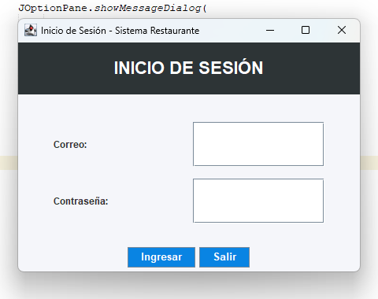
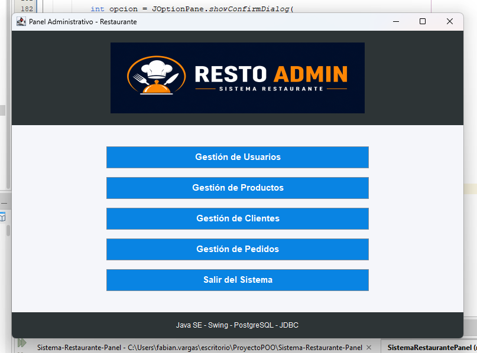
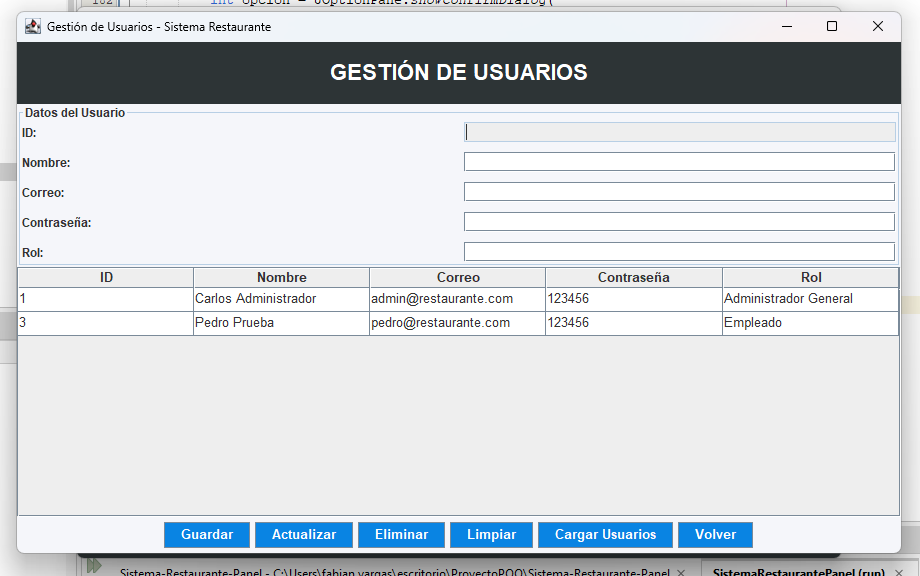
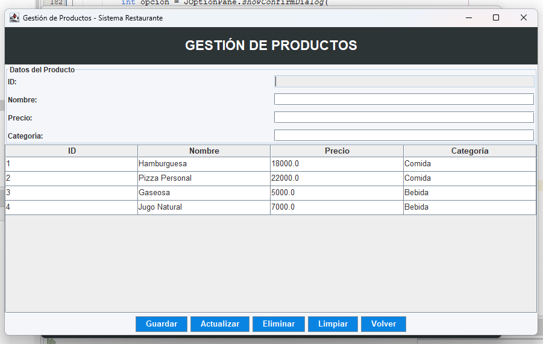
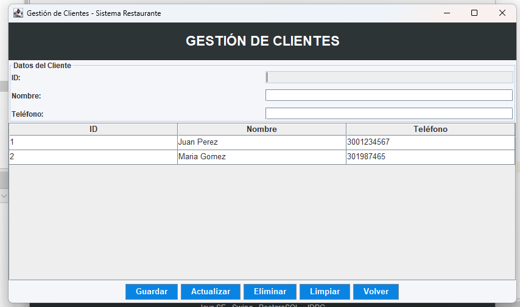
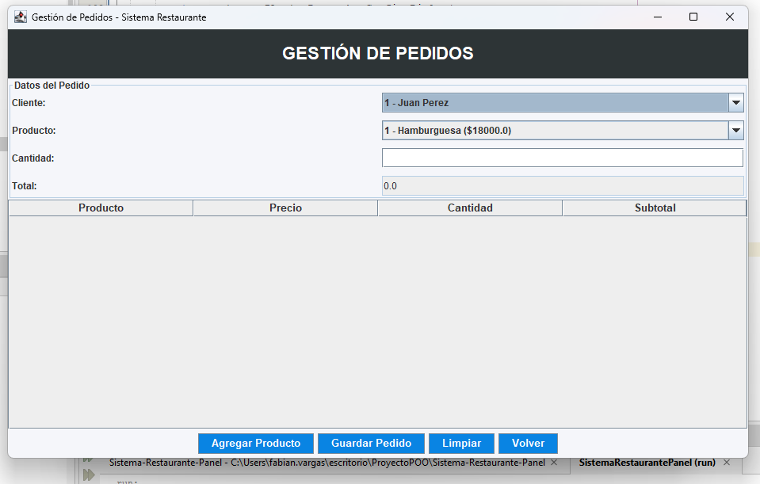

# 🍽️ Sistema-Restaurante-Panel

Proyecto de sistema de gestión de restaurante desarrollado con Java Swing y PostgreSQL.

---

# 👨‍💻 Estudiante

- Jeison Fabian Cepeda Vargas - 1005150274

# 👨‍🏫 Profesor

- Mag. Carlos Adolfo Beltrán Castro

# 📅 Tecnología de Desarrollo de Sistemas Informáticos
I Semestre 2026

---

# 🚀 Descripción del Proyecto

Este proyecto consiste en un sistema de gestión de restaurante desarrollado en Java SE utilizando interfaces gráficas con Swing y conexión a PostgreSQL mediante JDBC.

El sistema permite administrar diferentes módulos del restaurante mediante operaciones CRUD conectadas directamente a la base de datos.

---

# ✅ Funcionalidades Implementadas

- ✔️ Menú principal administrativo
- ✔️ Conexión a PostgreSQL mediante JDBC
- ✔️ CRUD de Usuarios
- ✔️ CRUD de Productos
- ✔️ CRUD de Clientes
- ✔️ CRUD de Pedidos
- ✔️ Navegación entre módulos
- ✔️ Interfaz gráfica desarrollada con Java Swing
- ✔️ Diseño visual personalizado
- ✔️ Botones de navegación y salida

---

# 📊 Diagrama Entidad - Relación


---
# 🏠 Inicio Sesion




# 🏠 Menú Principal



---

# 👤 Módulo Usuarios



---

# 🍔 Módulo Productos



---

# 👥 Módulo Clientes



---

# 📦 Módulo Pedidos



---

# 🧰 Tecnologías Utilizadas

- Java SE
- Java Swing
- PostgreSQL
- JDBC
- Apache NetBeans IDE
- Git
- GitHub

---

# 📂 Estructura del Proyecto

```text
Sistema-Restaurante-Panel
│
├── capturas/
├── database/
├── docs/
├── src/
│   ├── conexion/
│   ├── dao/
│   ├── main/
│   ├── modelo/
│   ├── resources/
│   └── vista/
│
├── build.xml
├── manifest.mf
└── README.md
```

---

# 🔧 Instalación y Ejecución

## 1. Clonar el repositorio

```bash
git clone https://github.com/vargasfabian51-art/Sistema-Restaurante-Panel.git
```

## 2. Abrir el proyecto en Apache NetBeans

Importar el proyecto desde la carpeta clonada.

---

## 3. Configurar PostgreSQL

Editar la clase:

```text
src/conexion/ConexionBD.java
```

Configurar:

```java
private static final String URL = "jdbc:postgresql://localhost:5433/restaurante_bd";
private static final String USER = "postgres";
private static final String PASSWORD = "1808";
```

---

## 4. Ejecutar Script SQL

Ejecutar el archivo:

```text
/database/script.sql
```

desde pgAdmin o PostgreSQL.

---

## 5. Ejecutar el Proyecto

Ejecutar:

```text
Main.java
```

Ubicada en:

```text
src/main/Main.java
```

---

# 📌 Estado del Proyecto

✅ Proyecto funcional  
✅ CRUDs conectados a PostgreSQL  
✅ Interfaz gráfica funcional  
✅ Navegación entre módulos  
✅ Repositorio GitHub configurado  

---

# 📷 Capturas del Sistema

Las capturas del sistema se encuentran en la carpeta:

```text
/capturas
```

---

# 🔗 Repositorio GitHub

Repositorio oficial del proyecto:

```text
https://github.com/vasrgafabian51-art/Sistema-Restaurante-Panel
```
