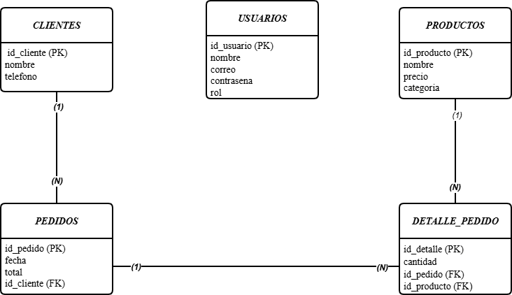

# Sistema-Restaurante-Panel
Proyecto de sistema de gestión de restaurante con Java Swing y PostgreSQL

👨‍💻 Estudiantes:
- Jeison Fabian Cepeda Vargas - 1005150274

👨‍🏫 Profesor:
-Mag. Carlos Adolfo Beltrán Castro

## ✅ Funcionalidades implementadas

- Gestión del menú principal
- Conexión a PostgreSQL mediante JDBC
- CRUD de usuarios conectado a base de datos
- Interfaz gráfica Swing para usuarios

## 📊 Diagrama Entidad-Relación

## 🖥️ Interfaz de Usuarios

## 🏠 Menu principal

## 🧰 Lista de Tecnologías Usadas

- Java SE
- Java Swing
- PostgreSQL
- JDBC
- NetBeans IDE
- GitHub

## 🔧 Instalación y ejecución

1. Clonar el repositorio:
   git clone (link de tu repo)

2. Abrir el proyecto en NetBeans

3. Configurar la conexión a PostgreSQL:
   - Usuario: postgres
   - Password: (tu contraseña)
   - Base de datos: restaurante_bd

4. Ejecutar el script SQL ubicado en:
   /database/script.sql

5. Ejecutar la clase Main.java

6. Usar el sistema desde el menú principal
