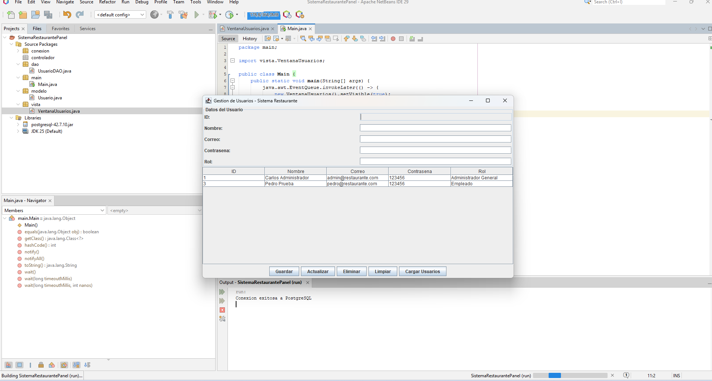
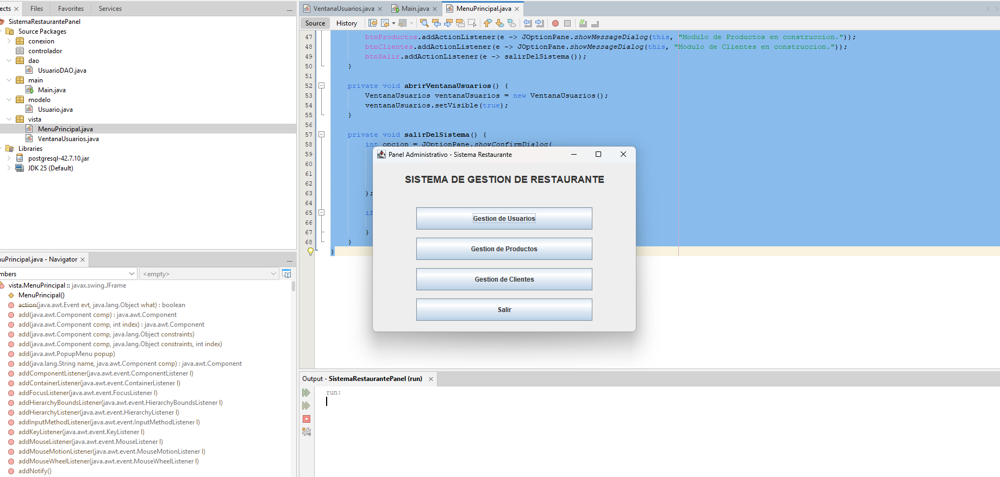

# Sistema-Restaurante-Panel
Proyecto de sistema de gestión de restaurante con Java Swing y PostgreSQL

## ✅ Funcionalidades implementadas

- Gestión del menú principal
- Conexión a PostgreSQL mediante JDBC
- CRUD de usuarios conectado a base de datos
- Interfaz gráfica Swing para usuarios

## 🖥️ Interfaz de Usuarios

## 🏠 Menu principal

